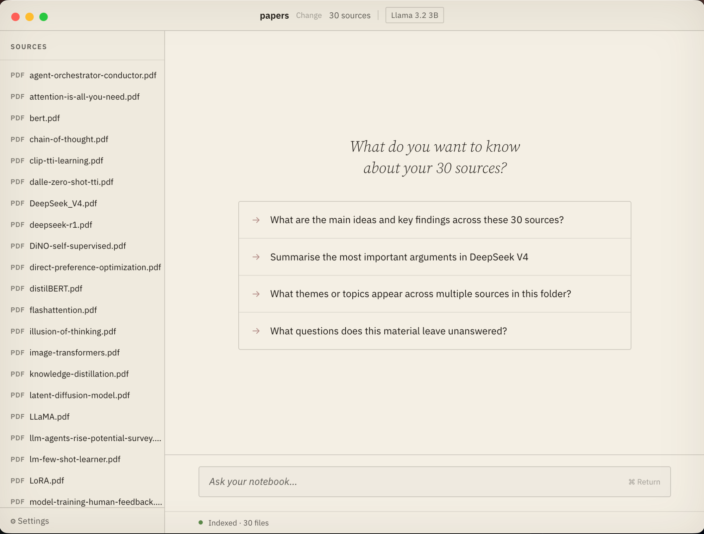

# Vidura

Chat with your second brain, entirely on your machine. Point it at any folder of documents and start asking questions. Nothing leaves your device, no file limits, no re-uploading when files change.

Built for knowledge workers who keep their thinking in local folders: journals, notes, research papers, codebases, wikis. Works with PDF, Markdown, and plain text.



---

## Install

One command. Takes about two minutes.

```bash
curl -fsSL https://raw.githubusercontent.com/sgrpanchal31/vidura/main/scripts/install.sh | bash
```

1. Paste that into Terminal and hit Return. The script installs Vidura and its dependencies.
2. On first launch, pick a model. Smaller models start faster; larger ones give better answers.
3. Open a folder of documents. Vidura indexes it and you can start asking questions immediately.

That's it. Nothing is uploaded anywhere.

<details>
<summary>Build from source</summary>

```bash
git clone https://github.com/sgrpanchal31/vidura.git
cd vidura
npm install
npm run dev
```

Requires Node.js 18+. macOS also needs Xcode Command Line Tools (`xcode-select --install`). Windows needs Visual Studio Build Tools with the "Desktop development with C++" workload.

</details>

---

## Features

- **Cited answers:** every response links back to the exact passage, file, and heading it came from
- **Folder sync:** watches your folder and picks up new or updated files automatically, no re-upload needed
- **No file limits:** NotebookLM caps you at 50 sources. Vidura has no cap.
- **Fully private:** all inference and embeddings run locally, no data ever leaves your machine
- **Multi-turn chat:** conversation history and query expansion stay in context across messages
- **macOS and Windows**

---

## Models

Choose one during setup. All models run fully on your device, downloaded once from HuggingFace.

| Model        | Size    | Notes                           |
| ------------ | ------- | ------------------------------- |
| Gemma 4 E2B  | ~3.4 GB | Google's compact model, any Mac |
| Llama 3.2 3B | ~2 GB   | Better reasoning, still quick   |
| Gemma 4 E4B  | ~5.2 GB | Efficient edge model, 8 GB+ RAM |
| Gemma 4 12B  | ~7 GB   | Best quality, needs 16 GB RAM   |
| Qwen 2.5 7B  | ~4.7 GB | Alternative top-tier, 32 GB RAM |

Apple Silicon gets Metal GPU acceleration automatically. Intel Mac and Windows use CPU inference.

---

## Tech

Electron, React, TypeScript. LLM inference via [node-llama-cpp](https://github.com/withcatai/node-llama-cpp). Vector search via [LanceDB](https://lancedb.github.io/lancedb/). Embeddings via [Qwen3-Embedding-0.6B-ONNX](https://huggingface.co/onnx-community/Qwen3-Embedding-0.6B-ONNX) (~600 MB, runs locally).

---

## License

MIT
